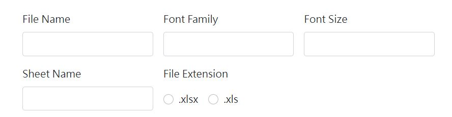
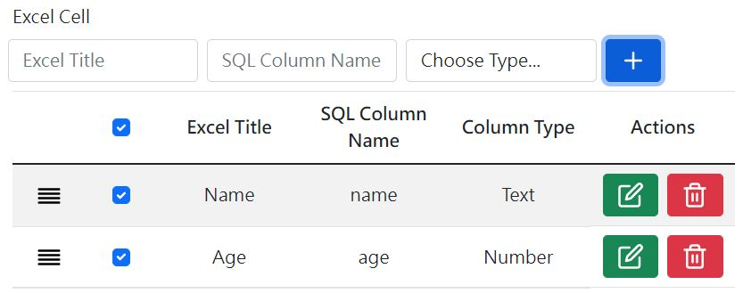
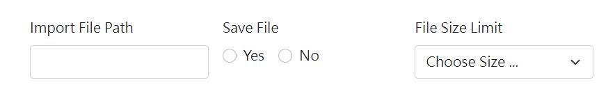

# NPOIExcel

> #### This is ASP.NET using NPOI library to export and import excel data C# function.

## Export

### File Name
Input your export file name.
### Font Family
Input your excel font.
### Font Size
Input your excel font size.
### Sheet Name
Input your excel sheet name.
### File Extension
Select your export file extension.
### Excel Cell
Add your excel title, the database field corresponding to the title and the data type.

## Import

### Import File Path
Input your file upload path.
### Save File
Select whether your file should be saved or not after you have read​​​​​​​ the excel data.
### File Size Limit
Select your file size limit when file upload.
### Excel Cell
This is the same as that for the export data.

## Live Demos
https://laura-chou.github.io/NPOIExcel/